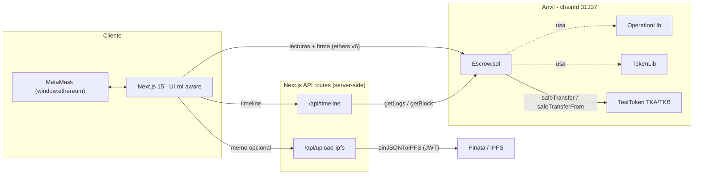

# Escrow DApp — intercambio atómico de tokens ERC20

[](https://github.com/alebeta06/Escrow-DApp/actions/workflows/test.yml)


Escrow no custodial para **intercambiar dos tokens ERC20 de forma atómica** entre dos partes que no
se conocen ni confían entre sí. CodeCrypto Módulo 9.

---

## Índice

- [El problema](#el-problema)
- [Arquitectura](#arquitectura)
- [Decisión técnica clave: CEI hecho arquitectura](#decisión-técnica-clave-cei-hecho-arquitectura)
- [Stack](#stack)
- [Prerequisitos](#prerequisitos)
- [Puesta en marcha local](#puesta-en-marcha-local)
- [Cómo usarla](#cómo-usarla)
- [Despliegue en Sepolia](#despliegue-en-sepolia)
- [Tests](#tests)
- [Variables de entorno](#variables-de-entorno)
- [Estructura del repo](#estructura-del-repo)
- [Ramas](#ramas)

---

## El problema

Dos personas quieren intercambiar tokens: Alice ofrece 100 TKA y quiere 150 TKB de Bob. Sin un tercero
de confianza, el que mueve primero pierde: si Alice envía sus TKA, Bob puede quedárselos y no pagar.

Un **escrow** rompe esa asimetría. Alice bloquea sus 100 TKA en el contrato al crear la operación; Bob
la completa pagando 150 TKB, y **en esa misma transacción** el contrato entrega los 100 TKA a Bob y los
150 TKB a Alice. O se ejecutan las dos piernas del swap, o no se ejecuta ninguna: **atomicidad**. Si
nadie completa, Alice cancela y recupera sus TKA. Nadie custodia fondos de terceros de forma insegura y
nadie puede quedarse a medias con los tokens del otro.

## Arquitectura

Vista compacta del sistema. El detalle está en [docs/ARCHITECTURE.md](docs/ARCHITECTURE.md).



## Decisión técnica clave: CEI hecho arquitectura

El proyecto lleva el patrón **Checks-Effects-Interactions** a la propia separación de ficheros:

- Las **librerías** (`OperationLib`, `TokenLib`) hacen los **EFFECTS**: mutan el estado (crear una
  operación, marcarla completada/cancelada, gestionar el allowlist). No transfieren tokens jamás.
- El **contrato** (`Escrow.sol`) hace los **CHECKS** (validaciones + custom errors) y las
  **INTERACTIONS** (transferencias, siempre vía `SafeERC20`), en ese orden estricto.

Que el estado se mute **antes** de la llamada externa es lo que hace el swap seguro: cuando el token
devuelve el control (un ERC20 malicioso podría reentrar), la operación ya está marcada como
`Completed`/`Cancelled`, así que no se puede volver a ejecutar. `ReentrancyGuard` es la segunda capa de
defensa sobre esa base. El razonamiento completo, con diagramas, está en
[docs/ARCHITECTURE.md](docs/ARCHITECTURE.md#flujo-cei-checks--effects--interactions).

## Stack

| Capa      | Tecnología                                                                         |
| --------- | ---------------------------------------------------------------------------------- |
| Contratos | Solidity 0.8.28 · Foundry (Forge/Anvil/Cast) · OpenZeppelin v5.6.1                 |
| Frontend  | Next.js 15 (App Router) · TypeScript strict · Tailwind v4 · ethers v6              |
| Off-chain | API routes de Next.js · Pinata (IPFS) · indexer de eventos propio                  |
| Tests     | Foundry (100% en los contratos core) · Playwright E2E (`window.ethereum` mockeado) |

## Prerequisitos

- [Foundry](https://book.getfoundry.sh/getting-started/installation) (`forge`, `anvil`, `cast`).
- [Node.js](https://nodejs.org) 20+ y **pnpm** vía corepack (`corepack enable pnpm`).
- [MetaMask](https://metamask.io) en el navegador.

## Puesta en marcha local

Se necesitan tres terminales. Desde la raíz del repo:

**1. Arranca Anvil** (terminal 1):

```bash
anvil
```

Levanta una blockchain local en `http://localhost:8545` (chainId `31337`) e imprime 10 cuentas de test
con sus claves privadas.

**2. Despliega y siembra estado** (terminal 2):

```bash
./deploy.sh
```

Este script: despliega `TestToken` TKA y TKB + el `Escrow`, autoriza ambos tokens en el allowlist,
siembra **1000 de cada token** a las 3 primeras cuentas de Anvil, y escribe las direcciones (+
`DEPLOY_BLOCK`, chainId `31337`) a `web/.env.development.local` y a `deployment-info.txt`. El frontend
lee esas direcciones vía variables `NEXT_PUBLIC_*` en `web/lib/contracts.ts` (versionado, con defaults
de Anvil), así que no hay que configurar nada.

**3. Arranca el frontend** (terminal 3):

```bash
cd web
pnpm install
pnpm dev
```

Abre [http://localhost:3000](http://localhost:3000).

**4. Configura MetaMask:**

- Añade una red manual: RPC `http://localhost:8545`, chainId `31337`.
- Importa una o dos cuentas de test de Anvil (usa las claves privadas que imprimió `anvil`) para
  actuar como creador y contraparte.

> **Nota:** `web/.env.development.local` es un artefacto **generado y gitignored** (`web/lib/contracts.ts`
> sí está versionado). Como las direcciones de Anvil son deterministas, casi nunca cambian; pero si
> reinicias Anvil, vuelve a ejecutar `./deploy.sh` para reescribir ese fichero.

## Cómo usarla

La UI es **rol-aware**: muestra acciones distintas según quién esté conectado, comparado con el estado
on-chain.

1. **Owner** (la cuenta que desplegó) → ve el panel **Token Allowlist** y puede autorizar más tokens.
2. **Creador** → crea una operación: elige tokens y cantidades, opcionalmente escribe un memo (se sube a
   IPFS). El flujo son 2 pasos on-chain: `approve` del token que ofrece y `createOperation`, que bloquea
   ese token en el Escrow.
3. **Contraparte** (cualquiera que no sea el creador) → en una operación activa ajena ve **Complete**:
   `approve` del token que paga + `completeOperation`, que liquida el swap atómicamente.
4. **Creador** → en su operación activa ve **Cancel**: recupera el token bloqueado.

La sección **Activity** muestra el timeline de eventos con timestamps (alimentada por el indexer).

## Despliegue en Sepolia

El despliegue a la testnet pública de Ethereum (Sepolia) usa un script **separado** del local,
[`deploy-sepolia.sh`](deploy-sepolia.sh): a diferencia del Anvil local, gasta gas real y es
irreversible, así que firma con un **keystore cifrado de Foundry** (`--account`, nunca la clave en
claro) y verifica los contratos en Etherscan.

**1. Crea un `.env` en la raíz del repo** (gitignored) con estas cinco variables:

```bash
SEPOLIA_RPC_URL=https://eth-sepolia.g.alchemy.com/v2/TU_API_KEY   # RPC de Sepolia (p.ej. Alchemy)
ETHERSCAN_API_KEY=TU_ETHERSCAN_API_KEY                            # para forge --verify
DEPLOYER_ACCOUNT=alebeta-admin                                    # alias del keystore de Foundry
DEPLOYER_ADDRESS=0x...                                            # dirección de ese keystore = OWNER
CLIENT_ADDRESS=0x...                                              # cuenta "cliente demo" (contraparte)
```

- **`DEPLOYER_ACCOUNT`** es el alias de un keystore ya importado en Foundry (`cast wallet import`). Esa
  cuenta será el **owner** del Escrow (`Ownable(msg.sender)`) y firma el despliegue; Foundry pedirá su
  passphrase de forma interactiva.
- **`DEPLOYER_ADDRESS`** debe ser la dirección pública de ese keystore (verifícala con
  `cast wallet address --account <alias>`). Se usa como `--sender` y como primer destinatario del seed.
- **`DEPLOYER_ADDRESS`** y **`CLIENT_ADDRESS`** reciben **1000 de cada token** (TKA/TKB) para poder
  ejecutar el swap de la demo. Internamente el script exporta `MINT_RECIPIENTS="$DEPLOYER_ADDRESS,$CLIENT_ADDRESS"`,
  que `script/Deploy.s.sol` lee vía `vm.envOr` (sin esa variable, en local, siembra a las 3 cuentas de Anvil).

**2. Ejecuta** (desde la raíz, con Foundry y el keystore configurados):

```bash
./deploy-sepolia.sh
```

El script hace un health-check de que el RPC es Sepolia (chainId `11155111`), despliega con `--slow`
(una tx a la vez, sin huecos de nonce) y `--verify` (verificación en Etherscan con los constructor args
correctos por contrato). Al terminar genera `deployment-info-sepolia.txt` (direcciones, deploy block y
enlaces a Etherscan) e imprime las cinco variables `NEXT_PUBLIC_*` listas para pegar en Vercel.

> Si la verificación en Etherscan falla por indexado tardío (el **despliegue** sí se completó), el
> propio script documenta en comentarios cómo reverificar por contrato con `forge verify-contract`.

## Tests

**Contratos (Foundry):**

```bash
forge test          # 32 tests
forge coverage      # 100% en Escrow.sol, OperationLib.sol y TokenLib.sol
```

`forge coverage` reporta 100% de líneas, statements, branches y funciones en los tres contratos core.
(El total agregado es menor solo porque `script/Deploy.s.sol` no se testea, algo esperado en un script
de despliegue.)

**Frontend (Playwright E2E):**

```bash
cd web
pnpm test:e2e       # 6 tests
```

Los tests arrancan **su propio Anvil efímero**, despliegan contra él y ejercitan los flujos reales
(connect, gate de rol, addToken, create/complete/cancel) firmando **transacciones reales**. Se mockea
únicamente el popup de la extensión: `window.ethereum` es un provider EIP-1193 respaldado por una
wallet de ethers con claves de test. Detalle en [docs/ARCHITECTURE.md](docs/ARCHITECTURE.md#testing).

> ⚠️ **Gotcha real:** no encadenes `pnpm build && pnpm test:e2e`. El `.next` de producción colisiona
> con el `next dev` que levantan los tests. Ejecútalos por separado.

## Variables de entorno

El frontend usa variables para Pinata (subida de memos, server-side) y el indexer (RPC de logs). Están
documentadas en **[web/README.md](web/README.md)**; copia `web/.env.example` a `web/.env.local` y
rellénalas. Ninguna es obligatoria para probar el escrow: sin `PINATA_JWT` simplemente no se suben
memos, y el resto de la app funciona igual.

## Estructura del repo

```text
Escrow-DApp/
├── src/
│   ├── Escrow.sol              # Contrato principal: CHECKS + INTERACTIONS
│   ├── EscrowTypes.sol         # Tipos compartidos (evita import cíclico lib↔contrato)
│   ├── libraries/
│   │   ├── OperationLib.sol    # EFFECTS sobre Operation
│   │   └── TokenLib.sol        # EFFECTS sobre el allowlist (TokenSet)
│   └── mocks/
│       └── TestToken.sol       # ERC20 de prueba (TKA/TKB)
├── test/
│   ├── Escrow.t.sol
│   ├── OperationLib.t.sol
│   ├── TokenLib.t.sol
│   └── harness/                # Exponen las funciones internal de las libs para testearlas
├── script/
│   └── Deploy.s.sol            # Despliegue local (Anvil)
├── deploy.sh                   # Orquesta el deploy y genera web/lib/contracts.ts
├── web/                        # Frontend Next.js 15 (ver web/README.md)
│   ├── app/                    # App Router + API routes (upload-ipfs, timeline)
│   ├── components/             # UI rol-aware
│   ├── hooks/                  # Lecturas on-chain + timeline
│   ├── lib/                    # abis, contracts (generado), ethereum, ipfs, errors
│   └── e2e/                    # Playwright (mock EIP-1193)
├── docs/
│   └── ARCHITECTURE.md         # Deep-dive con diagramas mermaid
└── .github/workflows/test.yml  # CI (forge fmt + build + test)
```

## Ramas

- **`anvil-local`** — desarrollo y demo en local contra Anvil (rama histórica).
- **`testnet`** (esta rama) — despliegue en Ethereum Sepolia y producción (Vercel). Hereda toda la
  documentación anterior y añade el flujo de [Despliegue en Sepolia](#despliegue-en-sepolia). Este
  README todavía no promete URLs públicas (demo en vivo): se añadirán cuando existan.
