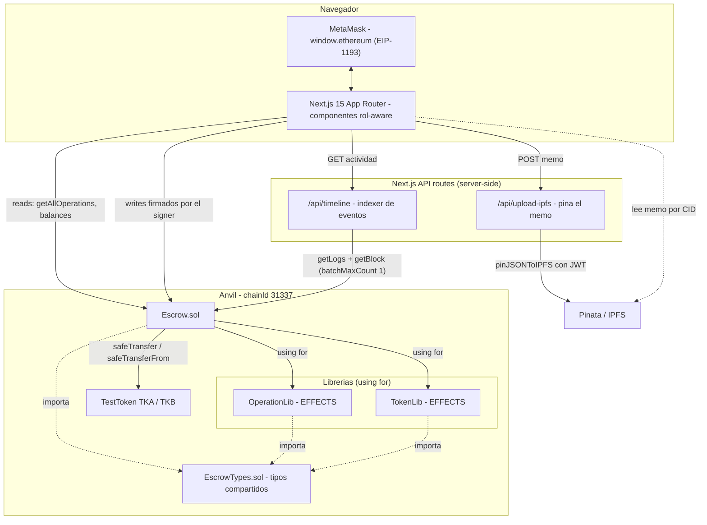
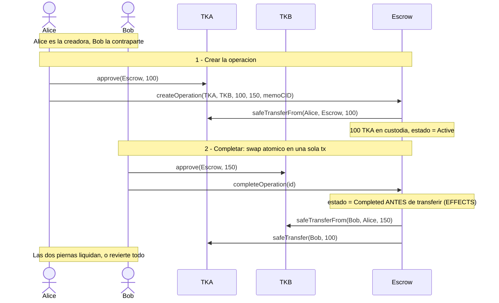
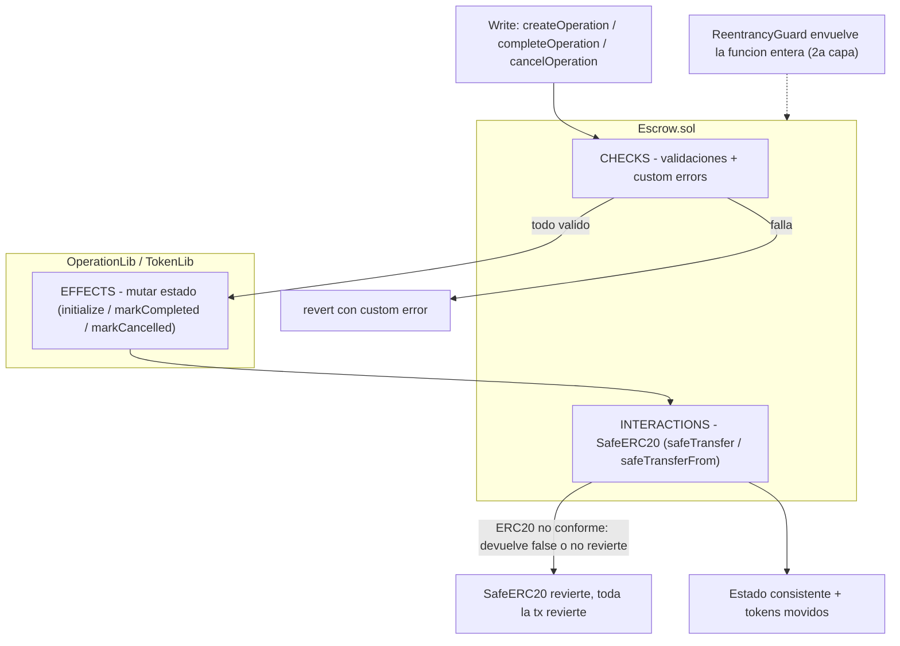

# Arquitectura — Escrow DApp

Deep-dive técnico del proyecto. Para la puesta en marcha y la visión general, ver el
[README](../README.md).

## Índice

- [Arquitectura del sistema](#arquitectura-del-sistema)
- [Arquitectura del contrato](#arquitectura-del-contrato)
- [Secuencia del swap atómico](#secuencia-del-swap-atómico)
- [Flujo CEI (Checks → Effects → Interactions)](#flujo-cei-checks--effects--interactions)
- [Por qué SafeERC20](#por-qué-safeerc20)
- [Flujo IPFS](#flujo-ipfs)
- [El indexer y la estrategia RPC](#el-indexer-y-la-estrategia-rpc)
- [Testing](#testing)
- [Limitaciones conocidas](#limitaciones-conocidas)

---

## Arquitectura del sistema

Tres capas: navegador (MetaMask + UI), servidor (API routes de Next.js) y cadena (Anvil con los
contratos). Pinata queda fuera como servicio de metadata.

Los **reads** on-chain van directos del navegador al RPC vía ethers. Los **writes** también, firmados
por el signer de MetaMask. Las dos API routes son server-side por razones distintas: `upload-ipfs`
porque la JWT de Pinata es secreta, y `timeline` porque el escaneo de logs conviene centralizarlo (y
así el RPC de logs tampoco se expone al cliente).

## Arquitectura del contrato

El contrato principal `Escrow.sol` delega toda mutación de estado en dos librerías, aplicadas con
`using for`:

- **`OperationLib`** — opera sobre un `Operation` en storage: `initialize` (crea la operación),
  `markCompleted` y `markCancelled` (transiciones de estado). Son los **EFFECTS** de las operaciones.
- **`TokenLib`** — opera sobre un `TokenSet` (el allowlist): `add`, `has`, `values`, `length`. Es un
  set de direcciones con su índice para iteración. Los **EFFECTS** del allowlist.

Ninguna librería transfiere tokens: eso es responsabilidad exclusiva del contrato (ver
[Flujo CEI](#flujo-cei-checks--effects--interactions)).

**`EscrowTypes.sol`** existe para romper una dependencia cíclica: el contrato y las librerías comparten
los tipos (`enum OperationStatus`, `struct Operation`, `struct TokenSet`). Si esos tipos vivieran en
`Escrow.sol`, las librerías tendrían que importar el contrato y el contrato las librerías → ciclo.
Sacándolos a un módulo de solo-tipos, ambos importan de `EscrowTypes` y no entre sí.

- **`enum OperationStatus`** → `Active` (0), `Completed` (1), `Cancelled` (2). Solo `Active` admite
  acciones; una operación cerrada es inmutable.
- **Custom errors** (nunca `require` con strings, por gas y claridad): `TokenNotAllowed`,
  `TokenAlreadyAllowed`, `SameToken`, `ZeroAmount`, `OperationNotActive`, `NotOperationCreator`,
  `CannotCompleteOwnOperation`.

## Secuencia del swap atómico

Dos transacciones on-chain de dos actores distintos, pero la liquidación del swap ocurre entera dentro
de `completeOperation`: ambas piernas o ninguna.

Si `completeOperation` revierte en cualquier punto (por ejemplo, Bob no aprobó suficiente TKB), toda la
transacción se deshace: no hay estado intermedio donde uno haya pagado y el otro no. Esa es la garantía
atómica. La cancelación es el camino de salida del creador: `cancelOperation` marca `Cancelled` y le
devuelve los TKA custodiados.

## Flujo CEI (Checks → Effects → Interactions)

Los tres writes (`createOperation`, `completeOperation`, `cancelOperation`) siguen el mismo orden
estricto. Es el argumento de seguridad central del proyecto.

**Por qué este orden garantiza la atomicidad y la seguridad:** las **INTERACTIONS** (llamadas externas
a tokens) van al final, después de que el estado ya está mutado. Cuando el contrato llama a un ERC20,
cede el control a código externo que —si el token es malicioso— podría reentrar y volver a llamar al
Escrow. Pero para entonces la operación ya está marcada `Completed`/`Cancelled`, así que el segundo
intento choca contra el check `OperationNotActive` y revierte. El estado consistente **antes** de la
llamada externa es lo que cierra la reentrada; `ReentrancyGuard` (de OpenZeppelin) es una segunda capa
redundante sobre esa base, no el único mecanismo.

## Por qué SafeERC20

Todas las transferencias usan `SafeERC20` (`safeTransfer` / `safeTransferFrom`), nunca llamadas crudas.
El estándar ERC20 está mal implementado por tokens populares: algunos (el caso clásico es USDT) **no
devuelven `bool`**, y otros devuelven `false` en vez de revertir cuando la transferencia falla. Con una
llamada cruda `token.transfer(...)`, una transferencia fallida podría **darse por buena** (el contrato
seguiría como si hubiera funcionado), rompiendo la atomicidad del swap. `SafeERC20` normaliza esos
comportamientos: si el token devuelve `false` o un dato inesperado, **revierte**. Así, en el swap, si
cualquiera de las dos transferencias no se ejecuta de verdad, la transacción entera se deshace.

## Flujo IPFS

El memo/términos de una operación es opcional y se guarda en IPFS; on-chain solo vive su CID (en el
campo `memoCID` del `struct Operation`).

1. El usuario escribe un memo (opcional) en el formulario de creación.
2. El frontend hace `POST /api/upload-ipfs`. **Esta subida es server-side a propósito**: la
   `PINATA_JWT` es un secreto y una llamada directa desde el navegador la expondría.
3. La route valida el memo, construye un JSON estructurado (`{ version, memo, createdAt, creator }`) y
   lo pina con `pinJSONToIPFS` (autenticación por JWT Bearer). Devuelve el CID.
4. El CID se pasa como argumento a `createOperation`, quedando on-chain en la operación.
5. Al listar operaciones, si `memoCID` no está vacío, la UI resuelve el memo desde un gateway IPFS
   público (`NEXT_PUBLIC_IPFS_GATEWAY`, con fallback a `gateway.pinata.cloud`). Si el gateway falla o
   tarda, la fila **no se rompe**: muestra el CID como enlace en vez del texto.

**Decisión clave: Pinata no bloquea el escrow.** Si no hay memo, `memoCID = ""` y no se llama a Pinata.
Si la subida falla, la UI ofrece reintentar o **crear sin memo**. El intercambio de tokens nunca
depende de que un servicio de metadata esté disponible.

## El indexer y la estrategia RPC

`getAllOperations()` da el **estado actual** de las operaciones, pero no la **historia con tiempos**:
quién hizo qué y cuándo. Para eso está el indexer (`GET /api/timeline`), que escanea los eventos del
contrato (`TokenAdded`, `OperationCreated`, `OperationCompleted`, `OperationCancelled`) y les añade el
timestamp de cada bloque, produciendo un timeline cronológico.

Decisiones de la estrategia RPC, pensadas para que en Sepolia (Fase 2) solo cambien variables de
entorno, no código:

- **Windowing desde `DEPLOY_BLOCK`, nunca desde el bloque 0.** `deploy.sh` extrae el bloque de
  despliegue del Escrow (del `receipts` de `run-latest.json`) y lo exporta como `DEPLOY_BLOCK` en
  `web/lib/contracts.ts`. El escaneo va en ventanas de `LOG_WINDOW_SIZE` bloques desde ahí hasta el
  bloque actual. Empezar en 0 sería malgastar miles de llamadas sobre bloques vacíos.
- **`batchMaxCount: 1`.** ethers v6 agrupa varias llamadas JSON-RPC en un batch por defecto (hasta
  100), y algunos RPC de free tier rechazan batches grandes. Se fuerza a 1 preventivamente.
- **Dedup de bloques + `Promise.all` para los timestamps.** Los eventos no traen timestamp; hay que
  pedir el bloque de cada uno con `getBlock`. Como varios eventos comparten bloque, primero se
  deduplican los `blockNumber` y luego se resuelven en paralelo — no una llamada por evento.
- **Correlación `operationId → creator`.** Los eventos `OperationCompleted` y `OperationCancelled` solo
  llevan el `id`, no la dirección del creador; se recupera del `OperationCreated` correspondiente para
  poder mostrar el actor.

En Sepolia la configuración típica es `LOGS_RPC_URL=https://sepolia.drpc.org` con
`LOG_WINDOW_SIZE=9000` (el límite práctico del free tier de dRPC). La caché en memoria (TTL corto)
evita re-escanear en cada request.

## Testing

**Contratos — 100% de cobertura en los tres contratos core** (`Escrow.sol`, `OperationLib.sol`,
`TokenLib.sol`): líneas, statements, branches y funciones. Para testear las funciones `internal` de las
librerías se usa el **harness pattern**: contratos de test (`test/harness/`) que exponen las internal
como external, de modo que se pueden llamar y asertar directamente. Las aserciones son reales (estado,
eventos, reverts con el custom error concreto), no ejecución hueca.

**Frontend — E2E con Playwright** contra un Anvil efímero por corrida. El enfoque clave es el mock de
`window.ethereum`: es un provider EIP-1193 **passthrough real** respaldado por una wallet de ethers con
claves de test. Reenvía casi todo al RPC de Anvil y solo intercepta las cuentas y la firma
(`eth_sendTransaction`), es decir, **solo se mockea el popup de la extensión, no la firma ni las
llamadas**. Se firma y minan transacciones reales.

Un detalle que costó depurar: dos writes consecutivos (`approve` → `create`) colisionaban con
`nonce has already been used`, porque ethers cachea el nonce `pending` (~250 ms) y Anvil mina al
instante, así que el segundo envío reutilizaba el nonce del primero. Se resolvió con un `NonceManager`
por cuenta (nonce local incremental), **no con `sleep`s**.

## Limitaciones conocidas

Honestidad de ingeniería: esto es lo que el proyecto **no** cubre, y por qué es aceptable en este
alcance.

- **El cambio de rol en los tests E2E no cubre `accountsChanged`.** Se cambia de cuenta reasignando la
  clave del mock y recargando la página (reconexión silenciosa vía `eth_accounts`); no se emite el
  evento `accountsChanged`, así que ese listener del provider queda sin ejercitar. Emitirlo introducía
  flakiness; se verificó a mano.
- **La caché del indexer muere en cada cold start serverless.** Es una caché en memoria (module-scope),
  no Redis/DB. En un despliegue serverless cada cold start la vacía y el primer request re-escanea.
  Aceptable para este alcance; nada de infraestructura extra.
- **Un rechazo de firma tras subir el memo deja un pin huérfano en Pinata.** El CID debe existir
  **antes** de la transacción porque es un argumento de `createOperation`. Si el usuario sube el memo y
  luego rechaza la firma, el JSON queda pinado sin operación que lo referencie. Es un coste menor
  (metadata huérfana) frente a la alternativa de complicar el flujo con limpieza transaccional.
